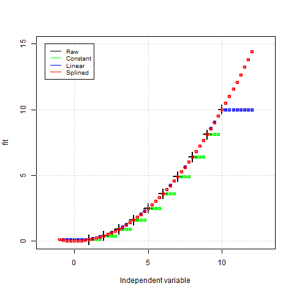

# Main part of project

## ``main.R``
File loads exampole data and calls functions performing operations aligning data

## ``interpolate.R``
File defines the used aligning methods. described function ``interpolate()`` calls one of 3 methods and returns results aligned with ``x_out`` parameter.

### testing unit: ``finterpolate.test.R``
File cointains an implementation of ``interpolate()`` function, performing operations using different methods on the basic data set.

# Visualization output

## ``plotlib.R``
``parameterplot()`` function simplifies generating plots of material paraeters (operational properties)

## ``comparefits.R``
Executes the aligning operations using all methods on example data set of real semiconductor material. Generates plots showing the differences

# Results
## basic data
The image below is generated by using 
```
xT = 1:10
yT = (1:10)^2/10
...
x_vec = seq(from = out.start, to = out.end, by = out.by)
y_con = interpolate(x_in = xT, y_in = yT, x_out = x_vec, method = "constant")
y_lin = interpolate(x_in = xT, y_in = yT, x_out = x_vec, method = "linear")
y_spl = interpolate(x_in = xT, y_in = yT, x_out = x_vec, method = "spline")
```



## Real data example
### FAQ
1. Is extrapolation outside of measurement range discullable

Yes, but it can fabricate data that was not measured. I think that, in case of highly inpredictible semiconductor materials, it is better not to extrapolate, or, if You have to do it (eg. in case of Your Supervisor) its **much better to take the boundary value**

2. Why extrapolation occurs on spline and is disabled in linear approximation
I wanted to show the difference outside the measurement range. It can be disabled. 

### Experimental data
**The included experimental data came from two diffrent samples, so in real life they can not be aligned.**

The resulted plots with comparisions of aligned parameters are shown below
 <table>
  <tr>
    <th>Constant-Linear</th>
    <th>Spline-Constant</th>
    <th>Spline-Linear</th>
  </tr>
  <tr>
    <td></td>
    <td></td>
    <td></td>
  </tr>
</table> 


Both **Spline** and **Linear** approximations give simmilar results inside measurement range.
