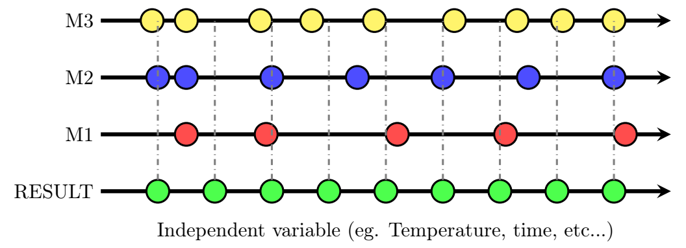

# Problem decription
Standard data aligment problemm there are a few data measurement fies and the measurements are not taken at the same independent variable value 

## What we have to do
- [x] Load data
- [x] try a few ways to align them
- [x] recalculate 
- [ ] visualize, prepare corrected tables as csv in the known format

## Syntax and technical tools used
1. R is used to implement math behind aligment.
2. R source explanation can be found [here](R/readme.md)

# Possible solutions
1. Ignore the offsets and align to the nearest
2. Align by linear interpolation
3. Align by spline

# Improve?
Please do not hesitate to open pull requests to add funtionality to the scripts
